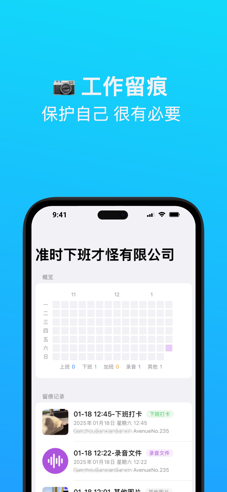
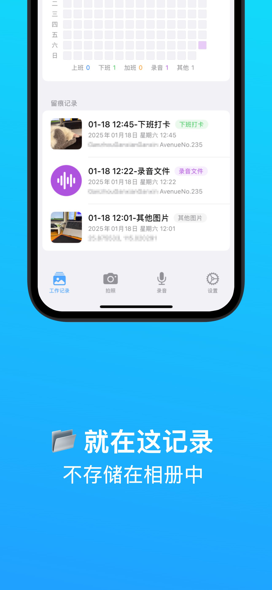
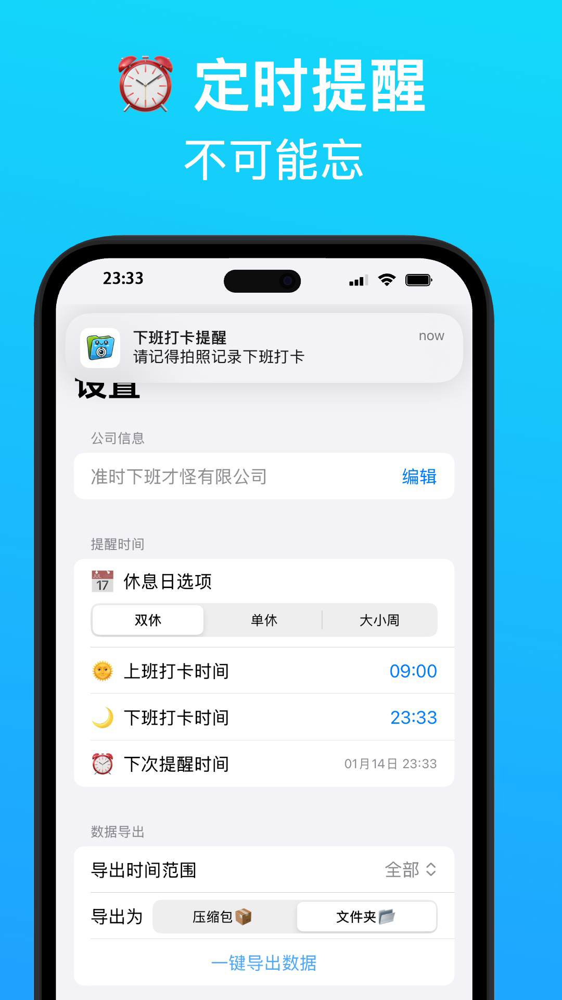
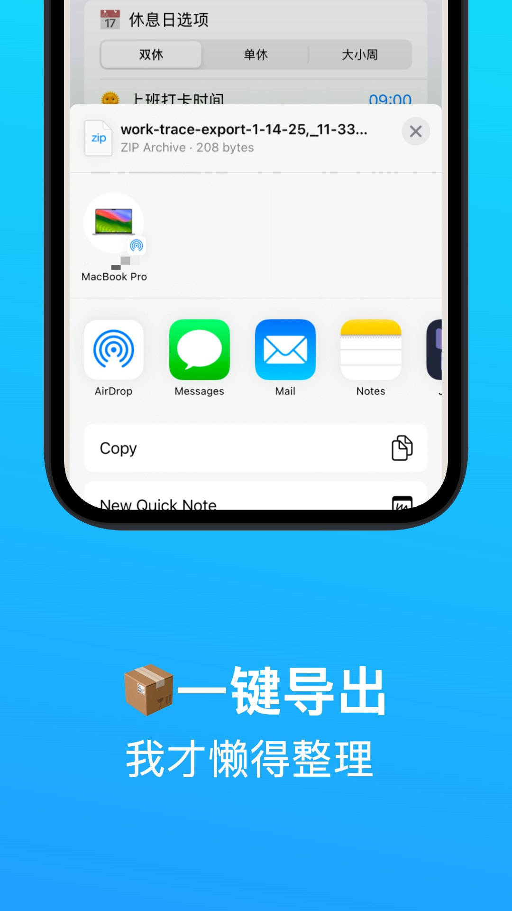

# 工作留痕 (Work Trace)

    

    
    

## 📱 简介

工作留痕是一款基于 SwiftUI 开发的 iOS 应用，旨在帮助用户通过定时拍照的方式记录工作痕迹，保护自身权益。应用完全本地化运行，确保用户数据安全。

##  ⬇️ 下载

App 网站: [work-trace.nolimit35.cn](https://work-trace.nolimit35.cn/)

## ✨ 主要功能

- 🕒 自定义工作日提醒时间
- 📸 智能拍照记录
  - 自动压缩图片
  - 保留时间戳
  - 记录地理位置信息
- 💾 本地数据存储
- 📊 打卡热力图展示
- 📤 数据一键导出
- 🔍 历史记录查看

## 📸 截图展示

    <!-- 这里添加 4-5 张主要功能截图 -->
    
    
    
    

## 🛠 技术特点

- 使用 SwiftUI 框架开发
- 遵循 MVVM 架构设计模式
- 采用 Swift Concurrency 处理异步操作
- 本地数据存储采用 SwiftData
- 完全本地运行，保护用户隐私

## 📦 依赖

本项目使用 Swift Package Manager 管理依赖：

- [Inject](https://github.com/krzysztofzablocki/Inject) - 用于开发时的热重载
- [ZIPFoundation](https://github.com/weichsel/ZIPFoundation) - 处理数据导出压缩

### 系统要求

- iOS 17.0 或更高版本
- Xcode 15.0 或更高版本